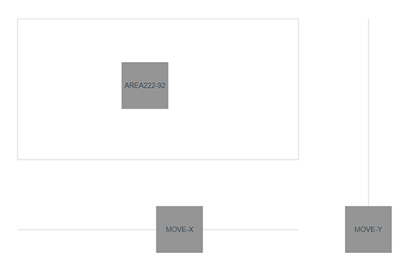

# vue-easy-drager
在Vue项目中快捷的实现元素的拖拽、限位、回调执行的工具
## 使用方法
###
- 采用npm或yarn安装
```bash
# 通过 npm 安装
npm install vue-easy-drager --save
# 通过 yarn 安装
yarn add vue-easy-drager

Vue3.+
import registerDrag from 'vue-easy-drager'
registerDrag(app).mount('#app')

Vue2.+
import Vue from 'vue'
import registerDrag from 'vue-easy-drager'
registerDrag(Vue)
```
- 使用案例
```html
<div v-drag="true"></div>
<div v-drag-x="true"></div>
<div v-drag-y="true"></div>
<div v-drag="handler"></div>
<div v-drag="{
              handler: handleDrag,
              limit: {y: [0, 200],x: [0, 500]}
             }"></div>
```

### 关于
- 本组件是由个人发起的非盈利性项目，由作者保留所有权利
- 如有更多需求或建议，请与[我](https://github.com/inobelieve "作者")联系

